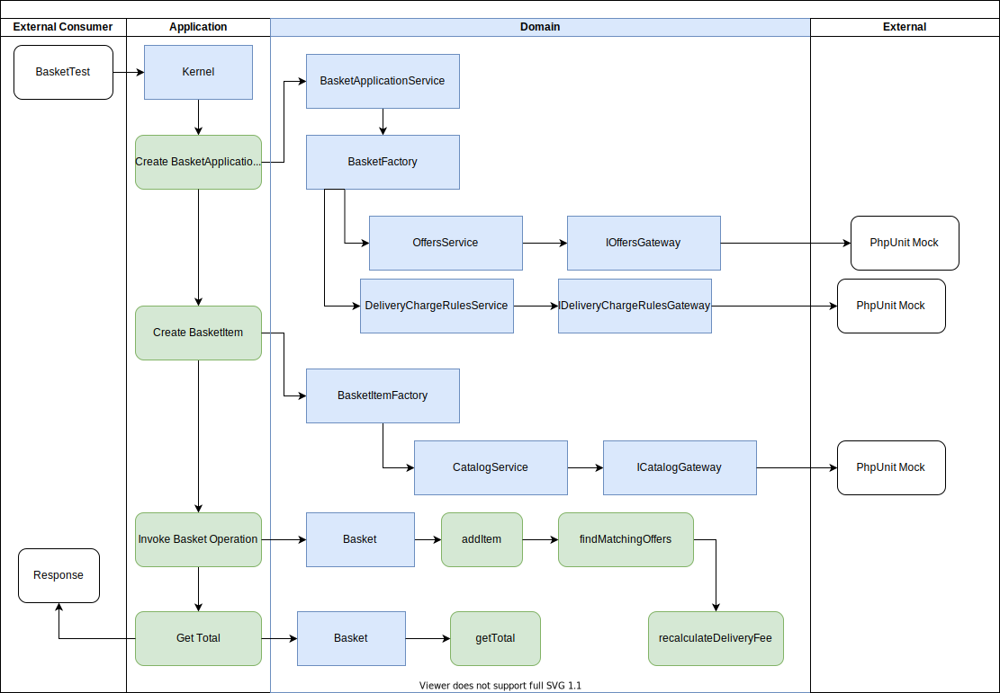

# Basket Test Task

## Assumptions
1. Product `Code` is unique.
2. There is one single delivery charge rule for an amount.
3. All offers has format "For product code A of quantity B give discount for product C of quantity D with E percent".
4. There is one single offer for product X of quantity Y.
5. There are no "cross offers" (buy X to get discount on Y, buy Y to get discounts on X).
6. On any given single product in the basket only one offer is valid.
7. All prices are in same currency.
8. All prices that we receive has period `.` as decimal separator.
9. All prices has fixed two precision points.

## Implementation details
1. DDD is used.
2. Composer is used.
3. Autoloader (PSR-4) is used.
4. All amounts internally are stored as integers.
5. Input parameters are heavily trusted.
6. Solution is executable via docker composer.
7. Solution is testable via phpunit.
8. Some unused method are left in some classes (assuming these would be used in the real app).

## Deployment instructions
1. Docker Desktop is required (please note that this was tested only on Mac).
2. Download source code and go to the root directory.
3. Execute `docker-compose up`. It may take some time to execute.
4. Execute `docker-compose run phpunit` to run test suite.
5. Execute `docker-compose down` to delete and clean up.

## Diagram
